# Unigrade

## Overview
Unigrade is a prototype database command-line user interface program. The database being the unigrade-physics google
sheet, which is a university style student module information database: it stores module information for enrolled
students, including which modules they are enrolled on for each of their academic years on their study programme,
as well as the module status and mark/grade achieved for their completed modules. The database also contains
information on the various module properties of all currently active and inactive modules on each academic
year and study programme, including availability and compulsory status by programme, as well as the credits allocated for a module.

The interface allows the user to both retrieve information from the database, and update the database
programmatically. Using the interface a user can register/unregister a student; enrol/unenrol a student on a module;
view the student's enrolled modules; and view/edit their module status and marks for a module. The user also can add
new modules; view/edit module properties; and finally view summary module statistics.

The unigrade program is written using python, and is deployed on heroku, in a mock terminal created by the
Code Institute, primarily using Node.js.

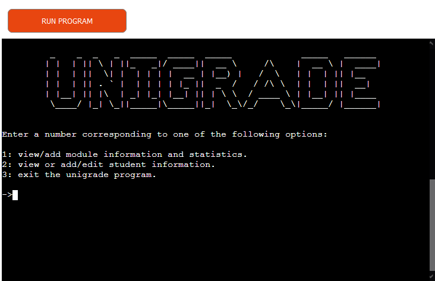

## Design Process

### User stories
As a potential user of a user interface program to a student module information database:
- I would want the program to improve the efficiency of finding and editing student data, ideally replacing any need to manually search for and edit student data directly in the database. Likewise, I would want the program to speed up the processes of enrolling a student on a module, or the time taken to register a new student in the database.
- I would like such a program to simplify updating a student's module status and mark, as well as the process of adding new modules to the database or editing the properties of existing modules, such as whether they are compulsory on a given study programme, and the number of credits they are worth.
- I would want a program that enables the programmatic updating of information in the database to have safeguards, and thorough input validation methods that prevent the accidental loss of data, or equally as bad, unintentional or incorrect data changes that too often occur when editing a database directly.
- I would want the interface program to be simple to use, with minimal effort to switch between or perform multiple different tasks sequentially. I would also want it to
allow it to be possible to undo or easily correct undesired changes.
- I would like it to make retrieving information easy, and also to display the retrieved information in a clear, useful and easy to read manner. I would also prefer if
the program could also perform manipulations on the retrieved data, in order to generate other useful information, such as student grade or module statistics.
- I want such a program to automate as much of a given task as possible, and require as little user input as possible, to save time, but also to reduce the risk of
human error.

### Program Objectives
As a prototype, the primary objective of the program is to act as the first version of a command-line UI program, that enables the programmatic retrieval of information from,
and editing of information in the unigrade-physics google sheet. The unigrade-physics google sheet is itself a prototype database designed to store and organise primarily student module information as part of a university style MSci or BSc degree study programme. Although with only minimal alterations, the database and UI program could be made suitable for other student courses. The prototype versions of both the UI program and database will feature information modelled on the University College London (UCL) MSci Physics and
BSc Physics degree programmes, with regard to the modules and their properties, the programme properties/structure, and the mark/grading system employed.

The command-line UI unigrade program will aim to simplify, reduce human errors, and make more efficient, the processes of storing, retrieving and editing student information pertaining to the modules they are enrolled on, as well as their performance on those modules. Additionally, it will aim to allow a user to perform the process of
registering/unregistering a student on/from MSci or BSc physics programmes, including setting information about their start and end years; a user will also be able to enrol/unenrol a student on/from a module; finally a user will be able to add new modules to the database, and edit the properties of existing modules. The unigrade program will also aim to display and generate new information from the retrieved information from the database, for example producing statistics. Finally, the unigrade program will aim to
maximise automation, minimise user input, and ideally be as user-friendly as possible for a command-line program.

### Planned Core Program Structure Overview
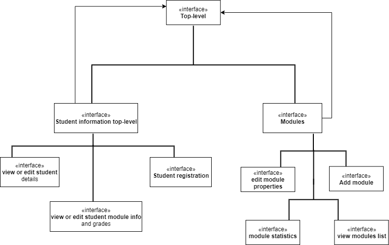

The above diagram shows the intended core program structure for the unigrade program. More precisely it shows the various types of interface the user will come across.
These interfaces will provide the user with a set of options to select from, to perform various tasks. They are organised into three levels, with the first level interface
directing the user, through user input, to either the modules or student top-level information interface that make up the 2nd level. These split the program into two distinct
branches, one branch handles all student related activities, the other all module related tasks; however, it will be possible to return from the 2nd level interfaces to the top
level interface, thus allowing the user to switch between module and student based activities. Each of the 2nd level interfaces will have options that lead the user to
one of their descendant 3rd level interfaces, and it is here where specific actions will be performed, for example student registration or adding a new module. It will be possible to go back from a 3rd-level interface to its parent 2nd level interface, allowing the user to navigate back and forth before committing to
a specific action.

## Current Existing Program Version

### Current features

#### General Features

##### User input features

Throughout the program flow control is determined primarily through user input, which generally takes the form of a user entering a number from a range of numbers
corresponding to the number of indexed options. This was as intended, as it minmises the complexity/amount of information the user has to enter, and also makes
inputs easier to validate and also errors less likely to occur. Aside from inputs for flow control most other types of user input take the form of short alphanumeric inputs,
for example a module code or year; or short strings separated by a comma, for example a student name. Thus, there are no long user inputs, thereby improving the user experience,
and minimising the risk of error in line with the program goals.

Also throughout the program, user inputs, in particular those for updating and retrieving information from the unigrade google sheet, are typically required to be confirmed by the user, who can then change the input if necessary, as many times as they wish. This allows the user to correct any mistakes in their inputs before proceeding with any process, thus reducing the risk of human error, and the time wasted repeating whole process again. On the whole this user confirmation feature does provide an additional level
of input validation, and gives the user the confidence to input data without the fear of making a mistake.

The screenshots below show examples of the different types of user input and the input confirmation feature.

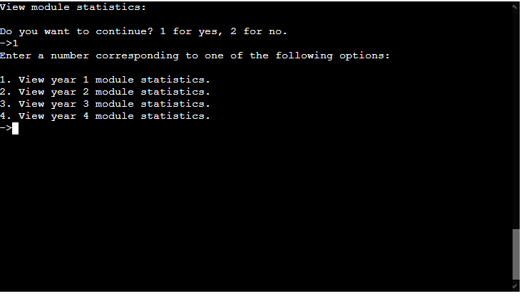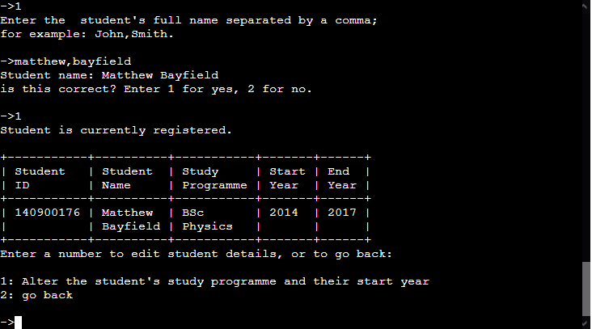

##### User feedback and terminal display features
User feedback is provided regularly to the user during any process and after most inputs, for example indicating to the user the success or failure of a process, the reason why an input is invalid, or 'loading...' type messages during a period of inactivity. In addition a user is often provided with reasons why a process cannot be performed,
as well any constraints that exist on editing information. Finally the user for certain processes is given usage guidance on the intended purpose behind performing a process, and
how and when it should be used. The screenshots below show examples of the mentioned user feedback features.

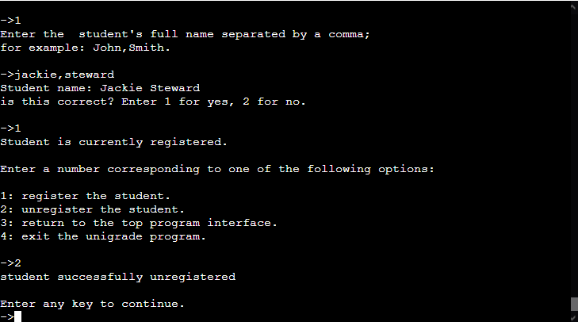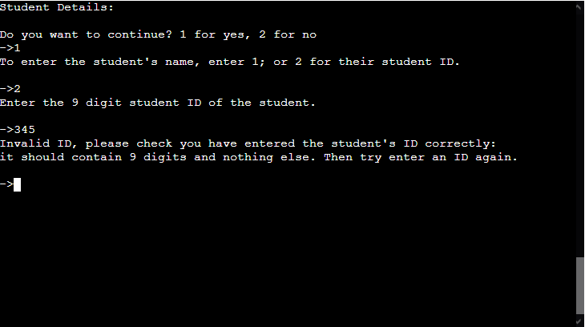

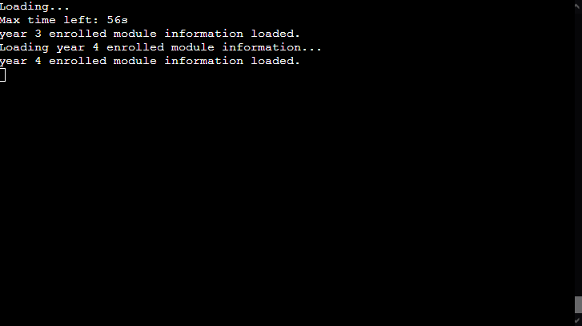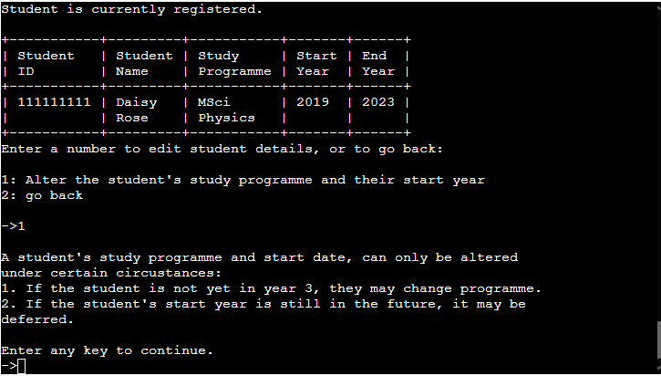

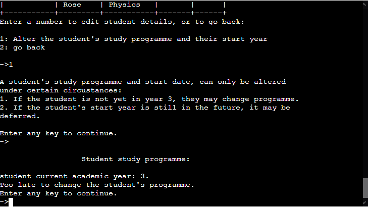

With regard to how content is displayed to the terminal, outputs are often time separated, appearing successively rather than all at once, thereby making it easier for the user 
to track and read, particularly when printed information causes scrolling of the terminal. To further aid a user in reading printed information, particularly if the process is to
retrieve and view student or module information, the user can choose when to proceed through 'enter any key to continue' inputs. Finally to optimise the readability and clarity
of displayed information in the terminal, titled lists and tables have been employed where possible. The screenshots below show examples of the terminal display features.

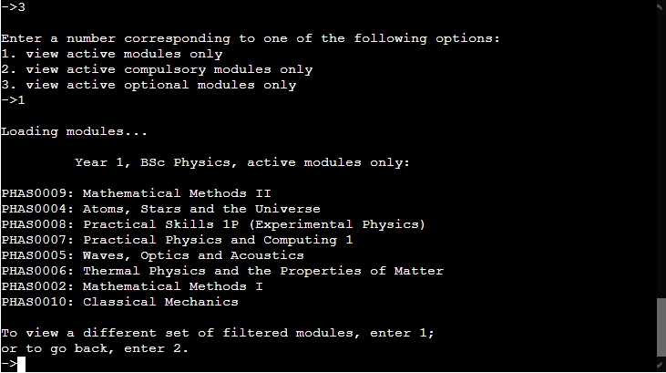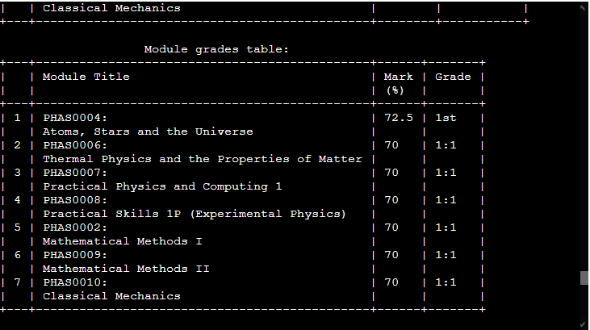

##### Flow control/Program navigation features
At the start of every interface and all processes the user is asked to confirm they wish to proceed. If they select no, they are then given options to return to a higher level interface, as well as to exit the program. Additionally in many activities the user has options to switch between closely related actvities, particulary when they cannot perform
the activity they desire, or if other things must be done first; for example if in trying to view/edit student information for a module, the user is informed the student is not registered in the database, they are provided the option of registering the student. 
Screenshots demonstrating examples of program navigation features:

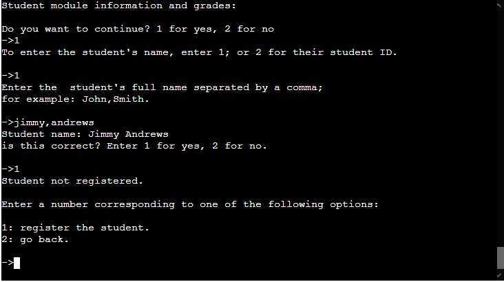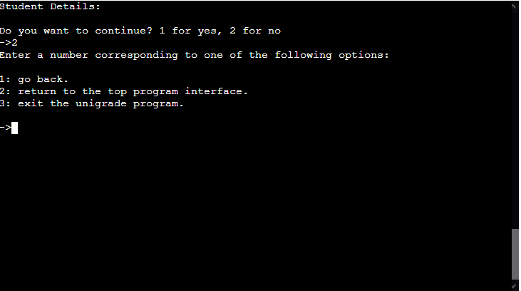

#### Main Interface Features
The program top-level interface is the first interface the user sees, it contains the unigrade logo, and three numerically indexed options for the user. The 3rd option allows the user to exit the program, the other two allow the user to specify which branch of the program is of interest, namely whether they want to perform a modules or student information related activity. A screenshot of the top-level interface can be seen below the overview section.

Having selected a branch of the program, the user either sees the student top-level information interface or the module interface, both clearly designated with the ASCII titles.
Both interfaces then display a list of indexed options to the user to direct them to one of the 3rd level interfaces, where specific activities can be selected by the user. As mentioned in the program navigation section, it is possible to navigate back and forth between parent and descendant interfaces, and sometimes between same level interfaces.
Below are screenshots of both 2nd level interfaces:

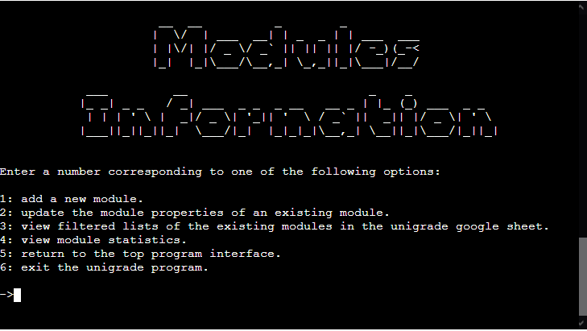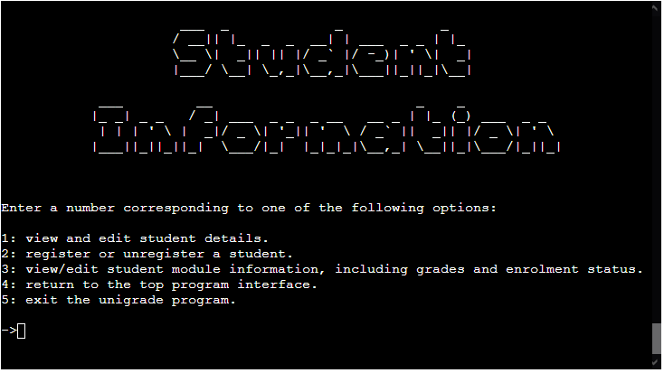
