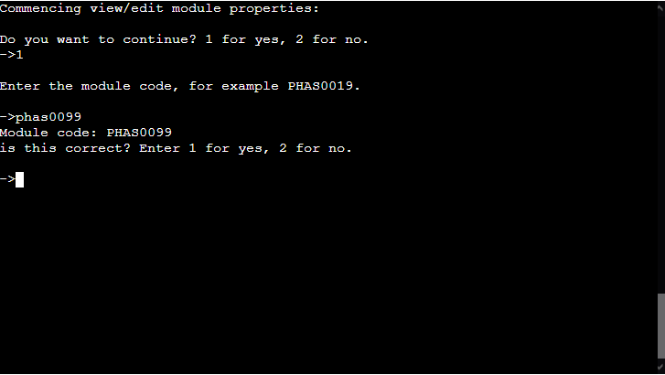

# Unigrade

## Overview
Unigrade is a prototype database command-line user interface program. The database being the unigrade-physics google
sheet, which is a university style student module information database: it stores module information for enrolled
students, including which modules they are enrolled on for each of their academic years on their study programme,
as well as the module status and mark/grade achieved for their completed modules. The database also contains
information on the various module properties of all currently active and inactive modules on each academic
year and study programme, including availability and compulsory status by programme, as well as the credits allocated for a module.

The interface allows the user to both retrieve information from the database, and update the database
programmatically. Using the interface a user can register/unregister a student; enrol/unenrol a student on a module;
view the student's enrolled modules; and view/edit their module status and marks for a module. The user also can add
new modules; view/edit module properties; and finally view summary module statistics.

The unigrade program is written using python, and is deployed on heroku, in a mock terminal created by the
Code Institute, primarily using Node.js.

## Design Process

### User stories
As a potential user of a user interface program to a student module information database:
- I would want the program to improve the efficiency of finding and editing student data, ideally replacing any need to manually search for and edit student data directly in the database. Likewise, I would want the program to speed up the processes of enrolling a student on a module, or the time taken to register a new student in the database.
- I would like such a program to simplify updating a student's module status and mark, as well as the process of adding new modules to the database or editing the properties of existing modules, such as whether they are compulsory on a given study programme, and the number of credits they are worth.
- I would want a program that enables the programmatic updating of information in the database to have safeguards, and thorough input validation methods that prevent the accidental loss of data, or equally as bad, unintentional or incorrect data changes that too often occur when editing a database directly.
- I would want the interface program to be simple to use, with minimal effort to switch between or perform multiple different tasks sequentially. I would also want it to
allow it to be possible to undo or easily correct undesired changes.
- I would like it to make retrieving information easy, and also to display the retrieved information in a clear, useful and easy to read manner. I would also prefer if
the program could also perform manipulations on the retrieved data, in order to generate other useful information, such as student grade or module statistics.
- I want such a program to automate as much of a given task as possible, and require as little user input as possible, to save time, but also to reduce the risk of
human error.

### Program Objectives
As a prototype, the primary objective of the program is to act as the first version of a command-line UI program, that enables the programmatic retrieval of information from,
and editing of information in the unigrade-physics google sheet. The unigrade-physics google sheet is itself a prototype database designed to store and organise primarily student module information as part of a university style MSci or BSc degree study programme. Although with only minimal alterations, the database and UI program could be made suitable for other student courses. The prototype versions of both the UI program and database will feature information modelled on the University College London (UCL) MSci Physics and
BSc Physics degree programmes, with regard to the modules and their properties, the programme properties/structure, and the mark/grading system employed.

The command-line UI unigrade program will aim to simplify, reduce human errors, and make more efficient, the processes of storing, retrieving and editing student information pertaining to the modules they are enrolled on, as well as their performance on those modules. Additionally, it will aim to allow a user to perform the process of
registering/unregistering a student on/from MSci or BSc physics programmes, including setting information about their start and end years; a user will also be able to enrol/unenrol a student on/from a module; finally a user will be able to add new modules to the database, and edit the properties of existing modules. The unigrade program will also aim to display and generate new information from the retrieved information from the database, for example producing statistics. Finally, the unigrade program will aim to
maximise automation, minimise user input, and ideally be as user-friendly as possible for a command-line program.

### Planned Core Program Structure Overview

The above diagram shows the intended core program structure for the unigrade program. More precisely it shows the various types of interface the user will come across.
These interfaces will provide the user with a set of options to select from, to perform various tasks. They are organised into three levels, with the first level interface
directing the user, through user input, to either the modules or student top-level information interface that make up the 2nd level. These split the program into two distinct
branches, one branch handles all student related activities, the other all module related tasks; however, it will be possible to return from the 2nd level interfaces to the top
level interface, thus allowing the user to switch between module and student based activities. Each of the 2nd level interfaces will have options that lead the user to
one of their descendant 3rd level interfaces, and it is here where specific actions will be performed, for example student registration or adding a new module. It will be possible to go back from a 3rd-level interface to its parent 2nd level interface, allowing the user to navigate back and forth before committing to
a specific action.

## Current Existing Program Version

### Current features

#### General Features

##### User input features

Throughout the program flow control is determined primarily through user input, which generally takes the form of a user entering a number from a range of numbers
corresponding to the number of indexed options. This was as intended, as it minmises the complexity/amount of information the user has to enter, and also makes
inputs easier to validate and also errors less likely to occur. Aside from inputs for flow control most other types of user input take the form of short alphanumeric inputs,
for example a module code or year; or short strings separated by a comma, for example a student name. Thus, there are no long user inputs, thereby improving the user experience,
and minimising the risk of error in line with the program goals.

Also throughout the program, user inputs, in particular those for updating and retrieving information from the unigrade google sheet, are typically required to be confirmed by the user, who can then change the input if necessary, as many times as they wish. This allows the user to correct any mistakes in their inputs before proceeding with any process, thus reducing the risk of human error, and the time wasted repeating the whole process again. On the whole this user confirmation feature does provide an additional level
of input validation, and gives the user the confidence to input data without the fear of making a mistake.

The screenshots below show examples of the different types of user input and the input confirmation feature.

##### User feedback and terminal display features
User feedback is provided regularly to the user during any process and after most inputs, for example indicating to the user the success or failure of a process, the reason why an input is invalid, or 'loading...' type messages during a period of inactivity. In addition a user is often provided with reasons why a process cannot be performed,
as well any constraints that exist on editing information. Finally the user for certain processes is given usage guidance on the intended purpose behind performing a process, and
how and when it should be used. The screenshots below show examples of the mentioned user feedback features.

With regard to how content is displayed to the terminal, outputs are often time separated, appearing successively rather than all at once, thereby making it easier for the user 
to track and read, particularly when printed information causes scrolling of the terminal. To further aid a user in reading printed information, particularly if the process is to
retrieve and view student or module information, the user can choose when to proceed through 'enter any key to continue' inputs. Finally to optimise the readability and clarity
of displayed information in the terminal, titled lists and tables have been employed where possible. The screenshots below show examples of the terminal display features.

##### Flow control/Program navigation features
At the start of every interface and all processes the user is asked to confirm they wish to proceed. If they select no, they are then given options to return to a higher level interface, as well as to exit the program. Additionally in many activities the user has options to switch between closely related actvities, particulary when they cannot perform
the activity they desire, or if other things must be done first; for example if in trying to view/edit student information for a module, the user is informed the student is not registered in the database, they are provided the option of registering the student. 
Screenshots demonstrating examples of program navigation features:

#### Main Interface Features
The program top-level interface is the first interface the user sees, it contains the unigrade logo, and three numerically indexed options for the user. The 3rd option allows the user to exit the program, the other two allow the user to specify which branch of the program is of interest, namely whether they want to perform a modules or student information related activity. A screenshot of the top-level interface can be seen below the overview section.

Having selected a branch of the program, the user either sees the student top-level information interface or the module interface, both clearly designated with the ASCII titles.
Both interfaces then display a list of indexed options to the user to direct them to one of the 3rd level interfaces, where specific activities can be selected by the user. As mentioned in the program navigation section, it is possible to navigate back and forth between parent and descendant interfaces, and sometimes between same level interfaces.
Below are screenshots of both 2nd level interfaces:

#### Input validation and exception handling features
All user inputs are validated, to ensure they are of the correct form and type. If an invalid input is entered by a user, a ValueError exception is raised, and an
error message printed to the user, sometimes explaining the specific issue with their input, if necessary. The user is then asked to input a value again until
a valid input is entered. As well as form and type validation, some inputs are validated based on whether they are unique or abide by any constraints of
the process in which they feature. This safeguarding feature is a way to prevent inputs that are valid with regard to their form and type, but that are not permitted
in the database for other reasons, from being entered. User inputs are also not case sensitive, as they are often reformatted before being added to the unigrade database;
again this simplifies user input, and reduces human error.

The major exception that occurs regularly in the program is a consequence of the gspread module, whose methods make use of the google sheets API, and thus are used constantly
to access, retrieve from, and update the unigrade google sheet. Due to the existence of a request rate limit of 60 requests per minute per user, the gspread methods often raise APIError exceptions when this rate is exceeded. In order to handle these exceptions and still be able to complete the desired requests, an exception handling feature was created, that handles the exceptions. This feature continuously retries a request until it is successful, whilst displaying to the user an updated timer indicating the max time left for loading. The same exception handling feature also handles all other APIErrors and general gspread exceptions by exiting the program, after informing the user of the issue, and
instructing them to restart the program.

#### Program activities

##### Student Registration
The user must enter the student name or ID of the student they wish to register or unregister from the unigrade-physics google sheet database.
Feedback is then provided indicating to the user whether the student is currently registered or not in the database. The user is then provided with
options to register or unregister the student. Choosing to register an already registered student, triggers feedback to the user that the user is already registered,
and then options are given to go back or unregister the student instead; the same happens when trying to unregister a student
who is not registered.

When selecting to register a student not yet registered, the user must input the unique student ID of the student if the name was entered previously, or the
student name if the ID was entered before. If a user enters an ID or name belonging to another student in the database, they are given feedback and given options to reenter the correct ID/name or abort the registration. If instead the user has provided valid unique identifiers, they must then enter the study programme, and student start year, where the start year is validated to ensure it has not yet passed. The end year for the student is then automatically set and displayed to the terminal as well as confirmation that the student is now registered. A table with the newly registered student details is then printed to the terminal. Finally the user is informed that the student is being checked to ensure they are enrolled on the compulsory modules for their current academic year. This feature enrols the student on any compulsory modules automatically if necessary, thus allowing the user to focus only on enrolling the student on their optional modules, when appropriate. The user when ready is then returned to the student information top-level interface. The screenshots below show a variation of the key steps involved in registering a student.

When selecting to unregister a registered student, the student data is deleted from the unigrade google sheet, and the user then given feedback confirming that the student has
been successfully unregistered. The user when ready is then returned to the student information top-level interface.

##### View and or edit student details
As with performing student registration, and for any other student information based activity in the unigrade program, the user must first enter the student name/ID of the student. Feedback is then provided indicating to the user whether the student is currently registered or not in the database. If the student is not registered, the user is provided the option of registering the student. Assuming the student is registered, the student's details are retrieved from the database and a table with them is printed to the terminal. The user can then choose to alter some of the student's mutable properties subject to constraints, and a usage message is printed to the terminal informing the user of
the constraints. The mutable property of the student study programme can be modified, provided the student has not
started their 3rd academic year, and the user is provided feedback if this not the case. If the student has not started their 3rd academic year, the user can choose their
study programme, and the new end year is automatically set for the student.

After the user has attempted to change the student's study programme, they are then given the option to alter the student's start year, subject to the constraint that the
student has yet to start their study programme. If the student has already started, the user receives feedback informing them of this. Once both mutable properties have attempted to be changed, the user receives confirmation that any changes made have been successful. Finally the updated student details table is printed to the terminal, and the user is given the option of trying to alter them again, or to go back to the previous interface. Below are screenshots showing a variation of some of the steps involved throughout the process:

##### View or edit student module information
After confirming to proceed and having entered the details of a currently registered student, the aforementioned auto enrol feature for compulsory modules is performed again,
so that if the student has entered a new academic year, they will automatically be enrolled on this year's compulsory modules for the student's programme.
Following this an array of tables grouped by year, are printed to the terminal that display all currently enrolled modules for the student, along with the module status and mark/grade for each module. The user is then given options to update the module status/mark of a module for the student; and enrol/unenrol a student on/from the available optional modules for their current academic year.

When enrolling a student on an available optional module for their current academic year, a table of the available optional modules for the student's academic year and programme is printed to the terminal, as well as the credits still available for the student; A user can only enrol the student on modules whose credits do not exceed the remaining credits outstanding for the student; if this occurs the user is given the option of unenrolling a student from an optional module. When unenrolling a student from a module, a table of the student's enrolled optional modules is displayed to the terminal; the user is then restricted to unenrolling a student from modules for which they are yet to complete. If the student is not enrolled on any modules, the user is given the option of enrolling a student on an optional module instead.
 
When choosing to edit a student's mark and module status, the enrolled module tables are reprinted to the terminal after it is cleared. The user can then select a module from one of the tables to edit the student's status and mark for; changing a student's module status to completed, then enables the user to
enter a validated percentage module mark input, and the grade is automatically calculated. Feedback is then provided to the user to indicate a successful update, and table
displaying the updated module information displayed. The user can then choose to update another module for the same student or go back.\n

Below are a few screenshots showing some of the initial steps in the process of viewing and editing a student's module information.

##### Add a new module
To add a new module to the unigrade google sheet, a user has to enter a module code input followed by a module name input, both of which are validated.
The combined code and name that make up the title is then searched for in the unigrade sheet, and the user given feedback as to whether the module already exists.
If it does exist, the user is then provided the options of editing its module properties or to go back. If the module does not exist, the user is then required
to choose the year for which it will be taught, before completing a series of yes or no equivalent inputs in order to assign the module properties. Finally, the user
is required to input the number of credits the module is worth, with the input validated to ensure the credits number is a multiple of 15. The module is then added to the
database, and feedback is printed to the terminal to confirm the module has been added. The user is then returned when ready to the modules interface.\n

This screenshot demonstrates the process of adding a module:

##### Edit a module's mutable properties
A user again must enter a module code and module name to search for a module title in the google sheet. If no module exists in the database, the user is given the option
of adding the module. If the module does exist, its current module properties are printed to the terminal; the user can select to edit its mutable properties or to go back.
The user then must complete a series of yes or no equivalent inputs in order to assign the module properties, before performing an input to assign a number of credits to
the module. The module is then updated in the database, and feedback is printed to the terminal to confirm this. The user is then returned when ready to the modules interface.\n

This screenshot demonstrates the process of editing a module's mutable properties:

##### View module lists
A user can choose from the options in the modules interface, to view filtered lists of the existing modules in the unigrade google sheet.
The user must specify via input a year, a programme or all programmes, and then choose one of a range of module property filters. A list of
the retrieved modules from the database, are then printed to the terminal. The user is then given the option of viewing another a list or
to go back. \n

This screenshot demonstrates the process of viewing a filtered module list:

##### View module statistics
The user having chosen the view module statistics option in the modules interface, must first select a year, followed by a module from the list of modules
printed to the terminal. If data exists for the module, the user must then pick to view information from one of the available cohort years for the module,
or choose to view all years combined. A formatted set of summary module statistics as well as the dataset size, are then printed to the terminal. The user
is then given the option to view another cohort year statistics for the same module, or is again asked to confirm if they wish to view another module's statistics.\n

This screenshot demonstrates the process of viewing a module's statistics:

### Data model

#### unigrade-physics google sheet database
As was mentioned in the program objectives, the unigrade-physics google sheet database contains university-style student module information and module information, in
particular modelled on the UCL physics MSci and BSc programmes. The purpose of the database is to contain all the information typical to a university grade/enrolement
tracking database, where it would be expected to store information for a student on what their study programme and start/end dates are; which modules are they enrolled on,
as well as their progress on those modules and the marks/grades achieved for a module. To this end it must also be possible to store information detailing
the properties of the modules taught past and present, including whether or not they are compulsory, how many credits they are worth and on what year they are taught.
With this in mind, the database is split into three sets of worksheets: a student details worksheet, that contains the identifiers of the student, and their programme
information; a set of module worksheets, each containing student module information for modules taught on a specific year, in particular information for all registered students
on which modules they are enrolled, their current module status and or module marks/grades; the final worksheet is the module properties worksheet that contains all
properties for each module in columns of modules organised by the year they are taught.\n

The following screenshots show each type of worksheet:

An updated published HTML version of the unigrade-physics google sheet is also viewable at [https://docs.google.com/spreadsheets/d/e/2PACX-1vTlJo08-IgSGswRiVIFJGSH5e37ZTLHrPRx7bWnzoO0tUvyipMj0YRR3tnfMPAm6edmDg1YyjYKz9hc/pubhtml
](https://docs.google.com/spreadsheets/d/e/2PACX-1vTlJo08-IgSGswRiVIFJGSH5e37ZTLHrPRx7bWnzoO0tUvyipMj0YRR3tnfMPAm6edmDg1YyjYKz9hc/pubhtml
)

#### Student and AcademicModule classes
The general approach to retrieving information from, and updating the unigrade google sheet database using the unigrade program interface, is based around the
use of core user interfaces to be used by a user to choose a particular activity to perform. These core interfaces are then responsible for creating instances
of classes modelled on student and module objects. Upon creating instances of each class, the various class methods for performing the program functionality
responsible for acting on the unigrade database would be called on them. Every time information is retrieved from the database for a module or student,
a corresponding instance is created with attribute mirroring those found in the database. All activities responsible for changing information in the database,
would first modify the instance attributes, and these are then be used to update the unigrade sheet.